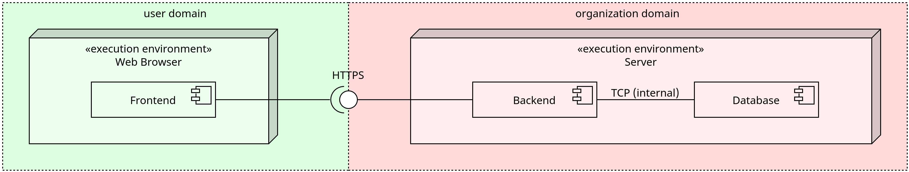

# Data Protection Concept: [Organization short name] [Project name]

This document is intended to provide information on how the users data is handled, stored and processed within **Quassel**.

Quassel is the name of the product. Installations of Quassel might live within different organizations and are embedded in different contexts or projects. This document is intended to be used as a template for the data protection concept of such installations.

- **Product name**: Quassel
- **Product vendor**: openscript GmbH
- **Organization**: [Organization name] [Organization short name]
- **Project name**: [Project name]
- **Responsible person and contact**: [Responsible person]

## System Overview

Quassel consist of the following components:

- **Frontend**: The user interface of the application, accessible via a web browser.
- **Backend**: The server-side application that handles user requests and data processing.
- **Database**: The storage system for user data, including account information, study data, and questionnaire responses.

### Installation

The Quassel application is installed on a server hosted by the [organization|product vendor]. The server is maintained and managed by the following parties:

- **Hosting provider**: [Hosting provider]
- **System administrators**: [System administrator]

Below are the details of the server environment:

- **Server location**: [Server location]
- **Server IPv4 address**: [Server IPv4 address]
- **Server operating system**: [Server operating system]
- **Server software**: [Server software]

### Server access

Access to the server is restricted to authorized personnel only. The following measures are in place to ensure secure server access:

- **SSH key-based authentication**: Access to the server is granted using SSH key pairs.
- **Firewall rules**: Inbound and outbound traffic is restricted to specific ports and IP addresses.
- **Regular audits**: Server access is regularly audited to identify and prevent unauthorized access.

The following personnel have access to the server:

- [System administrator 1] [Role]: [Organization] [Email address] [Phone number]
- [System administrator 2] [Role]: [Organization] [Email address] [Phone number]

### Data Domains

The following data domains are relevant for the Quassel application:

- **User domain (green)**: Data controlled and owned by the user, such as information that isn't transmitted to the server.
- **Organization domain (red)**: Data controlled and owned by the organization, such as study data and questionnaire responses.

This data protection concept **focuses on the organization domain**, as the user domain is not transmitted to the server.

### Data Classification

The data stored in the Quassel application can be categorized into the following types:

- **Sensitive**: Personal information that requires special protection, such as birth dates and questionnaire responses.
- **Non-sensitive**: General information that is not considered sensitive, such as study titles and user roles.

## Data Structure

The following data is processed and persistently stored within the Quassel application:

### User

- **id**: Unique identifier for the user.
- **email**: The email address of the user.
- **password**: The hashed password of the user.
- **role**: The role of the user, which can be either "ASSISTANT" or "ADMIN".

### Participant

- **id**: Unique identifier for the participant.
- **birthday**: The birthdate of the participant (sensitive).

### Study

- **id**: Unique identifier for the study.
- **title**: The title of the study.

### Questionnaire (sensitive)

- **id**: Unique identifier for the questionnaire.
- **startedAt**: The starting date of the questionnaire.
- **endedAt**: The ending date of the questionnaire.
- **title**: The title of the questionnaire.
- **remark**: Additional remarks for the questionnaire.
- **createdAt**: The date the questionnaire was created.
- **completedAt**: The date the questionnaire was completed.
- **study**: Reference to the associated study.
- **participant**: Reference to the associated participant.

### Entry (sensitive)

- **id**: Unique identifier for the entry.
- **startedAt**: The starting time of the entry.
- **endedAt**: The ending time of the entry.
- **weekday**: The weekday of the entry.
- **weeklyRecurring**: The weekly recurrence of the entry.
- **questionnaire**: Reference to the associated questionnaire.
- **carer**: Reference to the associated carer.

### EntryLanguage (sensitive)

- **id**: Unique identifier for the entry language.
- **ratio**: The ratio in percent of the entry language.
- **language**: Reference to the associated language.
- **entry**: Reference to the associated entry.

### Carer

- **id**: Unique identifier for the carer.
- **name**: The name of the carer.
- **color**: The color used to display entries in the calendar.
- **participant**: Reference to the associated participant.

### Language

- **id**: Unique identifier for the language.
- **name**: The name of the language.
- **ietfBcp47**: The IETF BCP 47 code of the language.
- **participant**: Reference to the associated participant.

## Data Handling

### Collection of Data

- User data is collected through various forms and interactions within the application.
- The types of data collected include personal information (e.g. birthdate) and questionnaire responses.

### Use of Data

- Collected data is used to facilitate the core functionalities of the application, such as managing user accounts, conducting studies, and analyzing questionnaire responses.
- Data is only used for the purposes explicitly stated at the time of collection and in accordance with user consent.

#### Sensitive Data

- Sensitive data, such as birthdates and questionnaire responses, is handled with extra care to ensure confidentiality and privacy. Only the necessary data is collected, such as:
  - Birthdates for age related data collection.
  - Birthdates for verifying the participant, because the name is not collected.
  - Language exposure data is collected for the purpose of research. The data is anonymized and only linked to a participant ID and not to a name.

## Data Storage

### Storage Locations

- User data is stored in a secure database with access controls in place to prevent unauthorized access.
- Backups of the database are performed regularly to ensure data integrity and availability.

### Data Encryption

- Sensitive data, such as passwords, is encrypted (hashing) using industry-standard encryption algorithms.
- Data in transit is protected using secure communication protocols (HTTPS via TLS).

## Data Processing

### Access Control

- Access to user data is restricted to authorized personnel only.
- Role-based access control (RBAC) is implemented to ensure that users can only access data relevant to their role (ASSISTANT, ADMINISTRATOR).
- Access is granted after successful authentication for a period of 24 hours by a unique token issued as a cookie to the user.
- Each access to the backend of the system is separately authorized.
- Each access to the backend updates the token's expiration date for another 24 hours.
- The token is invalidated after 24 hours of inactivity.
- The token is regenerated on each request by using a rolling key to prevent replay attacks ([libsodium](https://doc.libsodium.org/)).
- The cookie is set with the `HttpOnly` and `Secure` flags to prevent XSS attacks.

### Data Minimization

- Only the minimum amount of sensitive data necessary for the intended purpose is collected and processed.
- Data that is no longer needed is securely deleted in accordance with data retention policies.

### Data Integrity

- Measures are in place to ensure the accuracy and completeness of user data.
- Regular audits and checks are performed to identify and rectify any data inconsistencies.

## Conclusion

The Quassel project is committed to protecting user data and ensuring its secure handling, storage, and processing. By implementing robust data protection measures and respecting user rights, we aim to maintain the trust and confidence of our users.
